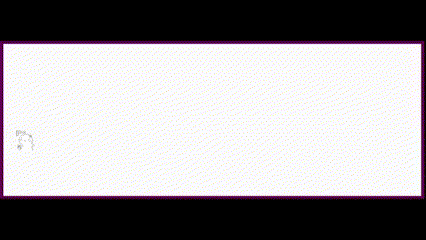

# Chương 0: Sự ngẫu nhiên

> **The generation of random numbers is**
>
> **too important to be left to chance.**
>
> **—Robert R. Coveyou**

Bắt đầu thôi. Nếu đã lâu bạn chưa lập trình bằng JavaScript (hoặc thậm chí làm toán học), chương này sẽ giúp bạn làm
quen lại với tư duy tính toán. Để bắt đầu hành trình lập trình mô phỏng tự nhiên của bạn, tôi sẽ giới thiệu bạn với một
số công cụ cơ bản cho việc lập trình mô phỏng: số ngẫu nhiên, phân phối ngẫu nhiên và nhiễu. Hãy nghĩ về điều này như là
phần đầu tiên (thứ 0!) của cuốn sách này - một bài học cơ bản và một lối vào cho những khả năng sẽ mở ra phía trước.


Trong Chương 1, tôi sẽ nói về khái niệm của một vector và cách nó sẽ phục vụ như một khối xây dựng cho việc mô phỏng
chuyển động trong suốt cuốn sách này. Nhưng trước khi tiến xa vào đó, hãy suy nghĩ về điều gì đó có nghĩa khi một vật
thể di chuyển trên một bức tranh kỹ thuật số. Tôi sẽ bắt đầu với một trong những mô phỏng chuyển động được biết đến
nhiều và đơn giản nhất: di chuyển ngẫu nhiên.

## Di chuyển ngẫu nhiên

Hãy tưởng tượng bạn đang đứng ở giữa một thanh xà. Mỗi 10 giây, bạn tung đồng xu lên. Mặt ngửa, bạn tiến một bước. Mặt
sấp, bạn lùi một bước. Đây là **di chuyển ngẫu nhiên**, một đường đi được xác định như là một chuỗi các bước ngẫu nhiên.
Bước (cẩn thận) ra khỏi thanh xà đó và xuống sàn, bạn có thể mở rộng di chuyển ngẫu nhiên của mình từ một chiều (chỉ di
chuyển về phía trước và phía sau) thành hai chiều (di chuyển về phía trước, phía sau, trái và phải). Bây giờ với bốn khả
năng, bạn phải tung cùng một đồng xu hai lần để xác định mỗi bước tiếp theo.

| Lần 1 | Lần 2 | Kết quả   |
|:------|-------|-----------|
| Ngửa  | Ngửa  | Tiến      |
| Ngửa  | Sấp   | Sang phải |
| Sấp   | Ngửa  | Sang trái |
| Sấp   | Sấp   | Lùi       |

Mặc dù có vẻ như là một thuật toán không phức tạp, nhưng bạn có thể sử dụng di chuyển ngẫu nhiên để mô hình hoá mọi hiện
tượng xảy ra trong thế giới thực, từ sự di chuyển của các phân tử trong chất khí, đến việc tìm thức ăn của một con vật,
đến hành vi của một người chơi cá cược dành một ngày tại sòng bạc. Đối với mục đích của chúng tôi, di chuyển ngẫu nhiên
là
nơi hoàn hảo để bắt đầu với ba lý do sau:

* Tôi muốn xem xét một khái niệm lập trình trọng tâm trong cuốn sách này: lập trình hướng đối tượng (OOP). Thực
  thể `Walker` mà tôi sắp tạo sẽ đóng vai trò là mẫu để sử dụng thiết kế hướng đối tượng để tạo ra những thứ di chuyển
  xung quanh khung vẽ đồ họa máy tính.
* Di chuyển ngẫu nhiên đặt ra hai câu hỏi mà tôi sẽ hỏi đi hỏi lại trong suốt cuốn sách này: “Làm thế nào để bạn xác
  định
  các quy tắc chi phối hành vi của các đối tượng của mình?”và sau đó là "Bạn triển khai các quy tắc này trong mã như thế
  nào?"
* Thỉnh thoảng, bạn sẽ cần hiểu biết cơ bản về tính ngẫu nhiên, xác suất và nhiễu Perlin cho các dự án trong cuốn sách
  này. Di chuyển ngẫu nhiên sẽ cho phép tôi chứng minh những điểm chính sẽ có ích sau này.

Trước tiên tôi sẽ xem xét một chút về OOP bằng cách mã hóa lớp `Walker` để tạo các đối tượng `Walker` có thể di chuyển
ngẫu
nhiên. This will be only a cursory review. Nếu bạn chưa từng làm việc với OOP trước đây, bạn có thể muốn thứ gì đó toàn
diện hơn; Tôi khuyên bạn nên dừng ở đây và
xem [the “Objects” section of my “Code! Programming with p5.js” video course at the Coding Train website](https://thecodingtrain.com/objects).

## Lớp `Walker`

**Đối tượng** trong JavaScript là một thực thể có cả dữ liệu và chức năng. Trong trường hợp này, đối tượng `Walker` phải
có dữ liệu về vị trí của nó trên khung vẽ và chức năng như khả năng tự vẽ chính nó hoặc di chuyển một bước.

**Lớp** là mẫu để xây dựng các thực thể thực sự của các đối tượng. Hãy nghĩ về lớp như một khuôn bánh quy và các đối
tượng như chính các chiếc bánh quy. Để tạo một đối tượng `Walker`, tôi sẽ bắt đầu bằng cách định nghĩa lớp `Walker`nghĩa
là gì.

`Walker` chỉ cần hai phần dữ liệu: một số cho tọa độ x và một số cho tọa độ y của nó. Tôi sẽ khởi tạo chúng ở giữa khung
vẽ để đặt vị trí bắt đầu của đối tượng. Tôi có thể thực hiện việc này trong **hàm khởi tạo** của lớp, được đặt tên phù
hợp là `constructor()`. Bạn có thể coi hàm tạo là hàm `setup()` của đối tượng. Nó chịu trách nhiệm xác định các thuộc
tính khởi tạo của một đối tượng, giống như `setup()` thực hiện cho toàn bộ bản phác thảo:

```javascript
class Walker {
    constructor()  // Các đối tượng có một hàm tạo nơi chúng được khởi tạo.
    {
        this.x = width / 2; // Đối tượng có dữ liệu.
        this.y = height / 2;
    }
}
```

Lưu ý việc sử dụng từ khóa `this` để gắn các thuộc tính vào chính đối tượng mới được tạo: `this.x` và `this.y`.

Thêm nữa, các lớp cũng có thể được định nghĩa với chức năng. Trong ví dụ này, một đối tượng `Walker` có hai chức năng,
được biết đến là **phương thức** trong ngữ cảnh OOP. Mặc dù phương thức về cơ bản là các hàm, sự khác biệt là phương
thức được định nghĩa bên trong một lớp và do đó được liên kết với một đối tượng hoặc lớp, trong khi hàm thì không. Từ
khóa `function` là một dấu hiệu dễ nhận biết: bạn sẽ thấy nó khi định nghĩa các hàm độc lập, nhưng nó sẽ không xuất hiện
bên trong một lớp. Tôi sẽ cố gắng sử dụng các thuật ngữ này một cách nhất quán trong cuốn sách này, nhưng người lập
trình thường sử dụng các thuật ngữ _hàm_ và _phương thức_ một cách hoán đổi.

Phương thức đầu tiên, `show()`, bao gồm mã để vẽ đối tượng (dưới dạng một chấm đen). Một lần nữa, đừng bao giờ quên
this.
khi tham chiếu đến các thuộc tính (biến) của đối tượng đó:

```javascript
show() // Đối tượng có phương thức.
{
    stroke(0);
    point(this.x, this.y);
}
```

Phương thức tiếp theo, `step()`, hướng dẫn đối tượng `Walker` di chuyển một bước. Đây là nơi mọi thứ trở nên thú vị hơn
một
chút. Bạn còn nhớ việc di chuyển ngẫu nhiên trên sàn nhà không? Bây giờ tôi sẽ sử dụng một bảng vẽ p5.js để biểu diễn
sàn
nhà đó. Có bốn bước có thể. Một bước sang phải có thể được mô phỏng bằng cách tăng `x` với `x++`; sang trái bằng cách
giảm `x`
với `x--`; tiến lên bằng cách đi lên một pixel (`y--`); và lùi lại bằng cách đi xuống một pixel (`y++`). Nhưng làm thế
nào để
mã có thể chọn từ bốn lựa chọn này?

Trước đây tôi đã nói rằng bạn có thể lật hai đồng xu. Tuy nhiên, trong p5.js, khi bạn muốn chọn ngẫu nhiên từ một danh
sách các tùy chọn, bạn chỉ cần tạo một số ngẫu nhiên với hàm `random()`. Nó chọn một giá trị dấu phẩy động ngẫu nhiên (
thập phân) trong bất kỳ phạm vi nào bạn muốn. Ở đây, tôi sử dụng 4 để chỉ một phạm vi từ 0 đến 4:

```javascript
let choice = floor(random(4));
```

Tôi khai báo một biến `choice` và gán cho nó một số nguyên ngẫu nhiên (số nguyên) bằng cách sử dụng `floor()` để loại bỏ
các
chữ số thập phân từ số dấu phẩy động ngẫu nhiên. Nói một cách chính xác, số được tạo bởi `random(4)` nằm trong phạm vi
từ
0 (bao gồm) đến 4 (không bao gồm), có nghĩa là nó không bao giờ thực sự là 4.0. Số cao nhất có thể tạo ra là ngay dưới
4 - 3.999999999 (với nhiều số 9 nhất mà JavaScript cho phép), mà sau đó `floor()` sẽ cắt bớt xuống còn 3, loại bỏ phần
thập phân. Do đó, tôi đã gán hiệu quả cho `choice` một giá trị là 0, 1, 2 hoặc 3.
> [!NOTE]
> ### Quy ước Lập trình
>
>Trong JavaScript, các biến có thể được khai báo bằng cách sử dụng `let` hoặc `const`. Một cách tiếp cận thông thường là
> khai
> báo tất cả các biến với `const` và thay đổi thành `let` khi cần. Trong ví dụ đầu tiên này, `const` sẽ phù hợp để khai
> báo
`choice` vì nó không bao giờ được gán một giá trị mới trong suốt quá trình sống của nó trong mỗi lần gọi `step()`. Mặc
> dù sự
> phân biệt này quan trọng, tôi chọn theo quy ước ví dụ của p5.js và khai báo tất cả các biến với `let`.
>
>Tôi nhận ra rằng JavaScript có cả `const` và `let` vì những lý do quan trọng. Tuy nhiên, sự phân biệt có thể gây phân
> tâm và
> gây rối cho người mới học. Tôi khuyến khích bạn khám phá thêm chủ đề này và đưa ra quyết định của riêng bạn về cách
> khai
> báo biến tốt nhất trong các bản phác thảo của bạn. Để biết thêm, bạn có thể đọc cuộc thảo luận xung quanh vấn
> đề [#3877](https://github.com/processing/p5.js/issues/3877)
> trong kho lưu trữ GitHub của p5.js.
>
>Tôi cũng chọn sử dụng toán tử bằng khắt khe (`===`) của JavaScript (và đối tác bất bình đẳng của nó, `!==`). Toán tử
> Boolean
> này kiểm tra cả giá trị và loại bằng nhau. Ví dụ, `3 === '3'` sẽ đánh giá là `false` vì các loại khác nhau (số so với
> chuỗi), mặc dù chúng trông giống nhau. Mặt khác, sử dụng toán tử bằng lỏng lẻo (`==`) trong `3 == '3'` sẽ cho kết quả
> là
`true` vì hai loại khác nhau được chuyển đổi để có thể so sánh. Mặc dù so sánh lỏng lẻo thường hoạt động tốt, nhưng đôi
> khi nó có thể dẫn đến kết quả không mong đợi, vì vậy `===` có lẽ là lựa chọn an toàn hơn.

Tiếp theo, `Walker` di chuyển bước phù hợp (trái, phải, lên hoặc xuống), tùy thuộc vào số ngẫu nhiên nào được chọn. Dưới
đây là phương thức `step()` hoàn thiện của lớp `Walker`:

```javascript
step()
{
    let choice = floor(random(4));  // 0, 1, 2, hoặc 3. Lựa chọn ngẫu nhiên xác định đi.
    if (choice === 0) {
        this.x++;
    } else if (choice === 1) {
        this.x--;
    } else if (choice === 2) {
        this.y++;
    } else {
        this.y--;
    }
}
```

Bây giờ sau khi tôi đã viết lớp, đã đến lúc tạo một đối tượng `Walker` thực sự trong bản phác thảo. Giả sử bạn đang muốn
mô phỏng một tình huống di chuyển ngẫu nhiên duy nhất, hãy bắt đầu với một biến toàn cục duy nhất:

```javascript
let walker; // Đối tượng Walker
```

Sau đó tạo đối tượng trong `setup()` bằng cách tham chiếu đến tên lớp với toán tử `new`:

```javascript
function setup()   // Nhớ cách p5.js hoạt động không? setup() được thực hiện một lần khi bản phác thảo bắt đầu.
{
    createCanvas(640, 240);
    walker = new Walker();  // Tạo Walker.
    background(255);
}
```

Cuối cùng, trong mỗi chu kỳ qua `draw()`, `walker` di chuyển một bước và vẽ một chấm.

## Ví dụ 0.1: Di chuyển ngẫu nhiên truyền thống

<div style="text-align: center; margin-left: auto; margin-right: auto;">


[](https://editor.p5js.org/natureofcode/sketches/5C69XyrlsR)

</div>

```javascript
function draw() // draw() sẽ lặp đi lặp lại mãi mãi (cho đến khi bạn thoát).
{
    // Gọi các hàm trên walker.
    walker.step();
    walker.show();
}
```

Vì nền được vẽ một lần trong `setup()`, thay vì xóa nó liên tục mỗi lần qua `draw()`, vết của di chuyển ngẫu nhiên sẽ
hiển thị trên bảng vẽ.

Tôi có thể điều chỉnh một vài thứ cho người di chuyển ngẫu nhiên. Đầu tiên, các bước của đối tượng `Walker` này chỉ giới
hạn trong 4 lựa chọn: lên, xuống, trái và phải. Nhưng bất kỳ pixel nào trên bảng vẽ cũng có 8 ô xung quanh, bao gồm cả
đường chéo (xem Hình 0.1). Một khả năng thứ chín, để ở lại chỗ cũ, cũng có thể là một lựa chọn.

|                              |
|:----------------------------------------------------------------------------------:|
| *Hình 0.1: Các bước của một người di chuyển ngẫu nhiên, có và không có đường chéo* |

Để triển khai một đối tượng `Walker` có thể bước đến bất kỳ pixel xung quanh nào (hoặc ở yên), tôi có thể chọn một số từ
0
đến 8 (chín lựa chọn có thể). Tuy nhiên, một cách khác để viết mã sẽ là chọn từ ba bước có thể dọc theo trục x (-1, 0,
hoặc 1) và ba bước có thể dọc theo trục y:

```javascript
step()
{
    let xstep = floor(random(3)) - 1;
    let ystep = floor(random(3)) - 1;
    // Tạo ra -1, 0, hoặc 1

    this.x += xstep;
    this.y += ystep;
}
```

Tối ưu hơn, tôi có thể loại bỏ `floor()` và sử dụng số dấu phẩy động gốc của hàm `random()` để tạo ra một phạm vi liên
tục
của các độ dài bước có thể từ -1 đến 1, như sau:

```javascript
step()
{
    let xstep = random(-1, 1);
    let ystep = random(-1, 1);
    // Bất kỳ số dấu phẩy động nào từ -1 đến 1

    this.x += xstep;
    this.y += ystep;
}
```

Tất cả những biến thể này trên cuộc di chuyển ngẫu nhiên truyền thống đều có một điểm chung: vào bất kỳ thời điểm nào,
xác
suất mà người di chuyển sẽ đi theo một hướng nhất định bằng với xác suất mà người di chuyển sẽ đi theo bất kỳ hướng
nào khác. Nói cách khác, nếu có bốn bước có thể, thì có 1 trong 4 (hoặc 25 phần trăm) cơ hội người di chuyển sẽ thực
hiện
bất kỳ bước nào. Với chín bước có thể, đó là một cơ hội 1 trong 9 (khoảng 11,1 phần trăm).

Thuận tiện thay, đây là cách hàm `random()` hoạt động. Bộ tạo số ngẫu nhiên của p5.js (hoạt động ẩn) tạo ra
**một phân phối đồng đều** của các số. Bạn có thể kiểm tra phân phối này bằng cách đếm mỗi lần một số ngẫu nhiên được
chọn
và vẽ đồ thị các giá trị đó.