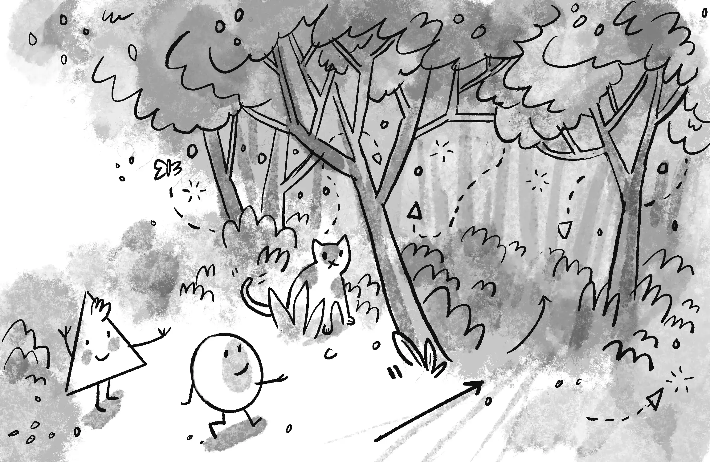

# Chương 0: Ngẫu nhiên

> **The generation of random numbers is**
>
> **too important to be left to chance.**
>
> **—Robert R. Coveyou**

Bắt đầu thôi. Nếu đã lâu bạn chưa lập trình bằng JavaScript (hoặc thậm chí làm toán học), chương này sẽ giúp bạn làm quen lại với tư duy tính toán. Để bắt đầu hành trình lập trình mô phỏng tự nhiên của bạn, tôi sẽ giới thiệu bạn với một số công cụ cơ bản cho việc lập trình mô phỏng: số ngẫu nhiên, phân phối ngẫu nhiên và nhiễu. Hãy nghĩ về điều này như là phần đầu tiên (thứ 0!) của cuốn sách này - một bài học cơ bản và một lối vào cho những khả năng sẽ mở ra phía trước.

Trong Chương 1, tôi sẽ nói về khái niệm của một vector và cách nó sẽ phục vụ như một khối xây dựng cho việc mô phỏng chuyển động trong suốt cuốn sách này. Nhưng trước khi tiến xa vào đó, hãy suy nghĩ về điều gì đó có nghĩa khi một vật thể di chuyển trên một bức tranh kỹ thuật số. Tôi sẽ bắt đầu với một trong những mô phỏng chuyển động được biết đến nhiều và đơn giản nhất: bước đi ngẫu nhiên.

## Bước đi ngẫu nhiên

Hãy tưởng tượng bạn đang đứng ở giữa một thanh xà. Mỗi 10 giây, bạn tung đồng xu lên. Mặt ngửa, bạn tiến một bước. Mặt sấp, bạn lùi một bước. Đây là **bước đi ngẫu nhiên**, một đường đi được xác định như là một chuỗi các bước ngẫu nhiên. Bước (cẩn thận) ra khỏi thanh xà đó và xuống sàn, bạn có thể mở rộng bước đi ngẫu nhiên của mình từ một chiều (chỉ di chuyển về phía trước và phía sau) thành hai chiều (di chuyển về phía trước, phía sau, trái và phải). Bây giờ với bốn khả năng, bạn phải tung cùng một đồng xu hai lần để xác định mỗi bước tiếp theo.

| Lần 1 | Lần 2 | Kết quả  |
| :----- | ------ | ---------- |
| Ngửa  | Ngửa  | Tiến      |
| Ngửa  | Sấp   | Sang phải |
| Sấp   | Ngửa  | Sang trái |
| Sấp   | Sấp   | Lùi       |

Mặc dù có vẻ như là một thuật toán không phức tạp, nhưng bạn có thể sử dụng bước đi ngẫu nhiên để mô hình hoá mọi hiện tượng xảy ra trong thế giới thực, từ sự di chuyển của các phân tử trong chất khí, đến việc tìm thức ăn của một con vật, đến hành vi của một người chơi cá cược dành một ngày tại sòng bạc. Đối với mục đích của chúng tôi, bước đi ngẫu nhiên là nơi hoàn hảo để bắt đầu với ba lý do sau:

* Tôi muốn xem xét một khái niệm lập trình trọng tâm trong cuốn sách này: lập trình hướng đối tượng (OOP). Thực thể Đi ngẫu nhiên mà tôi sắp tạo sẽ đóng vai trò là mẫu để sử dụng thiết kế hướng đối tượng để tạo ra những thứ di chuyển xung quanh khung vẽ đồ họa máy tính.
* Bước đi ngẫu nhiên đặt ra hai câu hỏi mà tôi sẽ hỏi đi hỏi lại trong suốt cuốn sách này: “Làm thế nào để bạn xác định các quy tắc chi phối hành vi của các đối tượng của mình?”và sau đó là "Bạn triển khai các quy tắc này trong mã như thế nào?"
* Thỉnh thoảng, bạn sẽ cần hiểu biết cơ bản về tính ngẫu nhiên, xác suất và nhiễu Perlin cho các dự án trong cuốn sách này. Bước đi ngẫu nhiên sẽ cho phép tôi chứng minh những điểm chính sẽ có ích sau này.

Trước tiên tôi sẽ xem xét một chút về OOP bằng cách mã hóa lớp `Walker` để tạo các đối tượng `Walker` có thể đi bộ ngẫu nhiên. This will be only a cursory review. Nếu bạn chưa từng làm việc với OOP trước đây, bạn có thể muốn thứ gì đó toàn diện hơn; Tôi khuyên bạn nên dừng ở đây và xem [the “Objects” section of my “Code! Programming with p5.js” video course at the Coding Train website](https://thecodingtrain.com/objects).

## Lớp Đi ngẫu nhiên

**Đối tượng** trong JavaScript là một thực thể có cả dữ liệu và chức năng. Trong trường hợp này, đối tượng `Walker` phải có dữ liệu về vị trí của nó trên khung vẽ và chức năng như khả năng tự vẽ chính nó hoặc thực hiện một bước.

**Lớp** là mẫu để xây dựng các thực thể thực sự của các đối tượng. Hãy nghĩ về lớp như một khuôn bánh quy và các đối tượng như chính các chiếc bánh quy. Để tạo một đối tượng `Walker`, tôi sẽ bắt đầu bằng cách định nghĩa lớp `Walker` nghĩa là gì khi là một người đi bộ.

